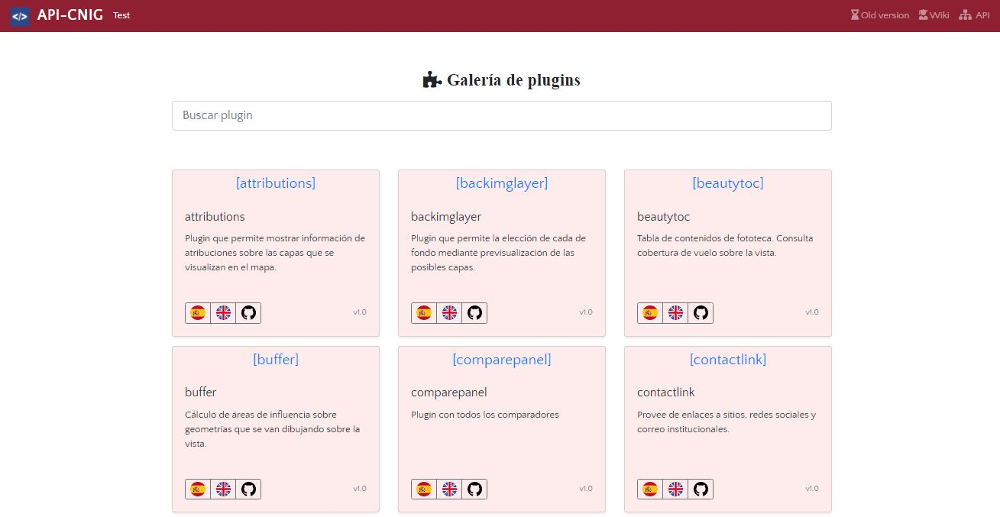

# Galería de Plugins APICNIG

Página para mostrar el catálogo de *plugins*.



Tras la carga incial de un **JSON**, se generan las *cards* de cada elemento. Las *cards* pueden filtrarse al escribir en la caja de búsqueda. El filtro se hace sobre los campos *name* y *description*. La búsqueda es *case insensitive* y *accent insensitive*.

La página tiene *header* y *sticky footer*. Para maquetar he utilizado Bootstrap 4.7.

## Configuración 

El listado de plugins puede confiogurarse modificando un fichero JSON.

```json
[
  {
    "name": "attributions",
    "plugin": "[attributions]",
    "version": "v1.0",
    "url_es": "https://componentes.cnig.es/api-core/attributions.jsp?language=es",
    "url_en": "https://componentes.cnig.es/api-core/attributions.jsp?language=en",
    "url_git": "https://github.com/IGN-CNIG/API-CNIG/tree/master/api-ign-js/src/plugins/attributions",
    "image": "img/api-logo.png",
    "description": "Plugin que permite mostrar información de atribuciones sobre las capas que se visualizan."
  },
```

* **Plugin**: nombre técnico del plugin según 
* **name**: nombre del plugin *readable*.
* **version**: Versión del plugin.
* **url_es**: test del plugin en español.
* **url_en**: test del plugin en inglés.
* **url_git**: repositorio en GiThub.
* **image**: url de la imagen de cabecera del plugin.
* **description**: breve descripción del funcionamiento del plugin.


## Cosas importantes

* Plataforma IDEE desde donde se enlaza [🔗 enlace](http://10.67.33.156:8085/cnig-api)


## Recursos externos

* Bootstrap [🔗 enlace](https://getbootstrap.com/docs/4.6/getting-started/introduction/)
* Normalize article [🔗 enlace](https://www.davidbcalhoun.com/2019/matching-accented-strings-in-javascript/)